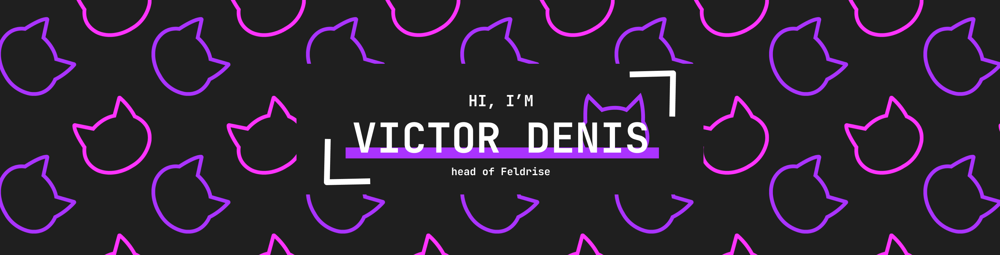

Bonjour par ici ! 👋

Je suis Victor, développeur et administrateur système depuis mon plus jeune âge. C'est avec ces compétences que j'ai découvert le monde incroyable de l'entrepreneuriat, et que j'essaie aujourd'hui d'aider un maximum de projet autour de moi pour rendre le monde meilleur.

Vous voulez en savoir plus ? [Ça se passe sur Feldrise](https://feldrise.com) 😉

## 💼 Skills

voir plus

 

 

 

## 📌 Pinned Repositories

 

 

 

 

## &#x1f4c8; GitHub Stats

 

 
 

> [Un merci à Braydon Coyer pour son super tuto et sa super template de profil ! 😉](https://daily.dev/blog/creating-a-killer-github-profile-readme-part-1)
